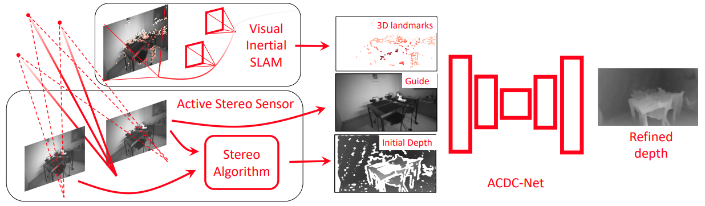
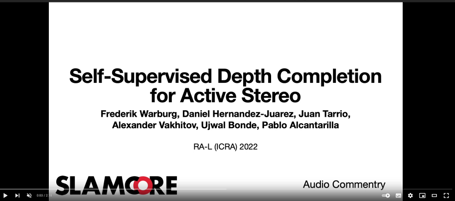

# ACDC-Net: Self-Supervised Depth Completion for Active Stereo
## Description

This repository implements [Self-Supervised Depth Completion for Active Stereo](https://arxiv.org/abs/2110.03234) inference, this work was accepted for publication in RAL and ICRA 2022. The code is realease under [CC Attribution-NonCommercial-ShareAlike 3.0 Unported License](https://creativecommons.org/licenses/by-nc-sa/3.0/legalcode).

[paper](https://arxiv.org/abs/2110.03234 "Self-Supervised Depth Completion for Active Stereo Paper") / [code](https://github.com/slamcore/acdc "Self-Supervised Depth Completion for Active Stereo Code") / [video](http://www.youtube.com/watch?v=mSuTyTz6npU) / [blog post](https://www.slamcore.com/blog/turbo-charging-depth-maps-with-ai)

[](#)

*Active stereo systems are used in many robotic applications that require 3D information. These depth sensors, however, suffer from stereo artefacts and do not provide dense depth estimates.In this work, we present the first self-supervised depth completion method for active stereo systems that predicts accurate dense depth maps. Our system leverages a feature-based visual inertial SLAM system to produce motion estimates and accurate (but sparse) 3D landmarks. The 3D landmarks are used both as model input and as supervision during training. The motion estimates are used in our novel reconstruction loss that relies on a combination of passive and active stereo frames, resulting in significant improvements in textureless areas that are common in indoor environments. Due to the nonexistence of publicly available active stereo datasets, we release a real dataset together with additional information for a publicly available synthetic dataset (TartanAir) needed for active depth completion and prediction. Through rigorous evaluations we show that our method outperforms state of the art on both datasets. Additionally we show how our method obtains more complete, and therefore safer, 3D maps when used in a robotic platform.*

**Check out our video:**

[](http://www.youtube.com/watch?v=mSuTyTz6npU "Self-Supervised Depth Completion for Active Stereo")

## Requirements

###### CUDA = v11.1
###### CuDNN >= v8.2.1
###### Python > 3.8

## Installation

To install:
```bash
➜ cd <path/to/local/repo>
➜ python3.8 -m pip install -r requirements.txt --no-cache-dir
```

## Datasets

For this work we created two datasets:

1. [D435i dataset (real data)](https://drive.google.com/file/d/1j-eIGaumhY7r01bt0lH4QFEzr309HDns/view?usp=sharing)
2. [Active TartanAir dataset (virtual data)](https://drive.google.com/file/d/1hyYzBhzsl9uK8bfmIufC0EVpfjZ7GC_H/view?usp=sharing)

Please, use the links provided to download the datasets. Once the datasets are downloaded copy them to: /data/datasets/d435i/ and /data/datasets/TartanAirEurocFormat/ or update the yaml files (acdc/configs) "data_path" to the correct path.

## Models

You can download the models used in the paper:

1. [Model with backbone ResNet-18 trained for D435i dataset](https://drive.google.com/file/d/1UnPdKsbO5c3zc8OhMsNiQVlWGehgBwtf/view?usp=sharing)
2. [Model with backbone ResNet-18 trained for Active TartanAir dataset](https://drive.google.com/file/d/1CAooq4TgtHxt7kk60d6iJtal74RllFWG/view?usp=sharing)
3. [Model with backbone ResNet-50 trained for D435i dataset](https://drive.google.com/file/d/1lymL3M8oxi1BqzJ_C2Pm2-8mCGNaeNN1/view?usp=sharing)
4. [Model with backbone ResNet-50 trained for Active TartanAir dataset](https://drive.google.com/file/d/1mf5QEFj8t3M73WCr1ZjmB97lYeBWPoz0/view?usp=sharing)

## Inference

This is the command you need to use for inference:
```bash
➜ cd <path/to/local/repo>
➜ python3.8 -m acdc.scripts.inference <PATH_TO_CONFIG> <PATH_TO_MODEL_WEIGHTS> -o <OUTPUT_FOLDER> [-cpu] [--workers N] [--seed N]
```

## Evaluation

This is the command you need to use for evaluation:
```bash
➜ cd <path/to/local/repo>
➜ python3.8 -m acdc.scripts.evaluate <PATH_TO_CONFIG> <RESULT_FOLDER> [--workers N]
```

## Reproducing paper experiments

You can find config files (yaml) in configs/depth_completion/realsense/ and configs/depth_completion/tartanair/ for reproducing results of Tables 1 and 2. Note that the model with backbone ResNet-18 on Active TartanAir dataset may produce slightly different results than the one described in the paper, the model was lost and we had to retrain.

## What to cite

If you use this code for your research, please kindly cite:

```
@article{Warburg22ral,
  author    = {Frederik Warburg and
               Daniel Hernandez-Juarez and
               Juan Tarrio and
               Alexander Vakhitov and
               Ujwal Bonde and
               Pablo F. Alcantarilla},
  title     = {Self-Supervised Depth Completion for Active Stereo},
  journal   = {{IEEE} Robotics Autom. Lett.},
  year      = {2022},
  note      = {This paper was also selected by ICRA'22 for presentation at the conference.}
}

```